# RAGFlow Data Model - Sequence Diagrams

## 1. User Registration & Tenant Creation

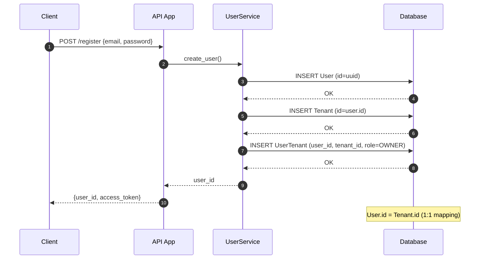

## 2. Knowledge Base Creation

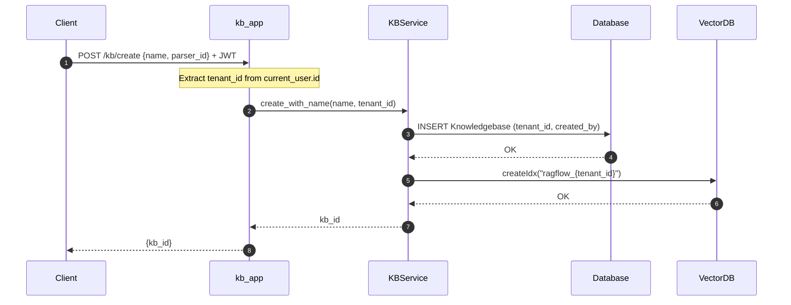

## 3. Document Upload & Processing

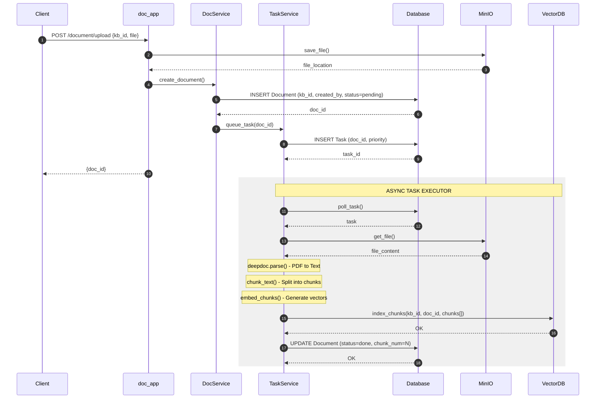

## 4. Search / Retrieval

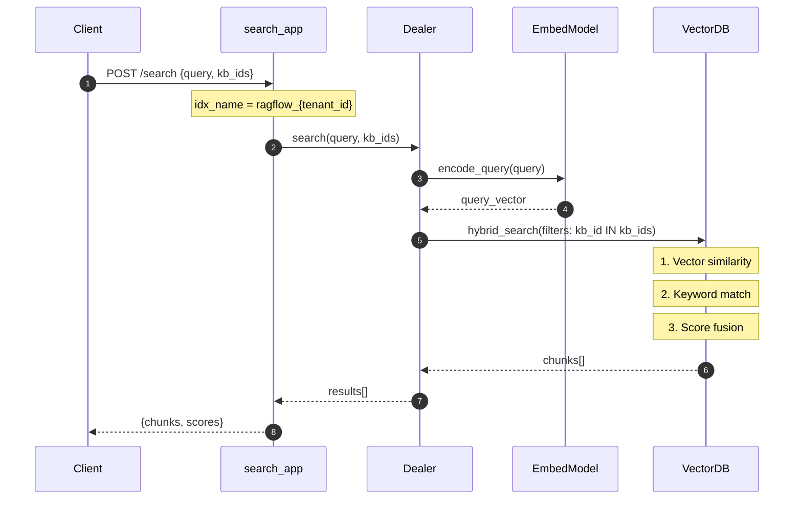

## 5. RAG Chat End-to-End

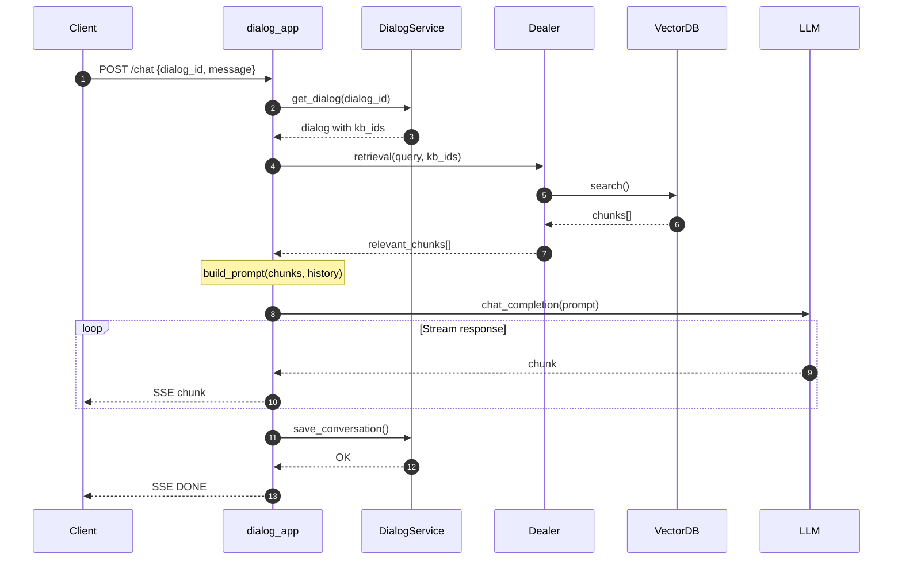

## 6. Multi-Tenant Data Isolation

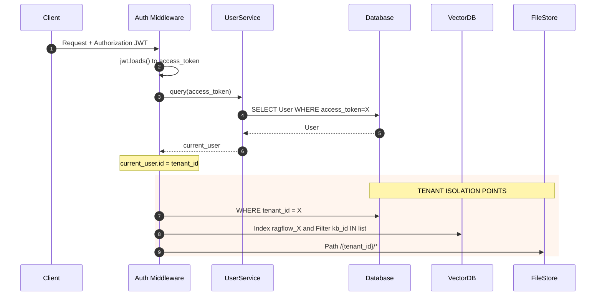

## 7. Entity Relationship Diagram

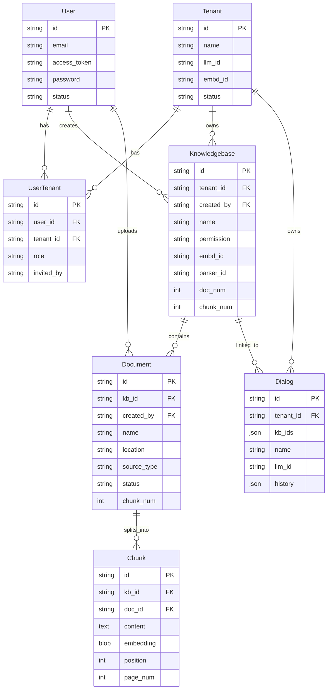

## 8. Document Processing Pipeline

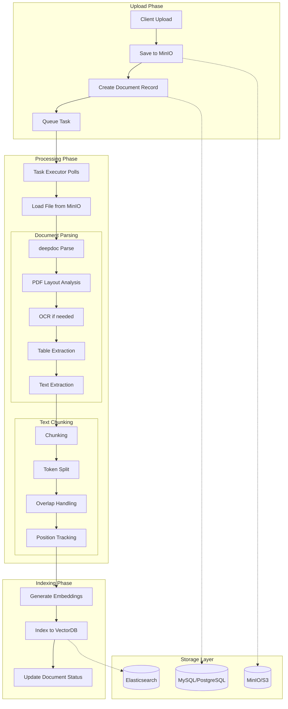

## 9. Multi-KB Federated Search

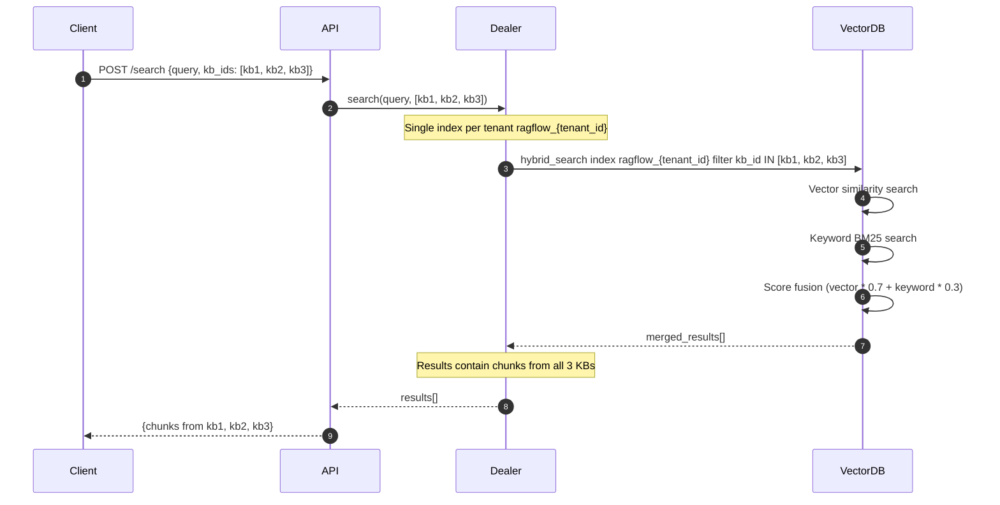

## 10. Permission Check Flow

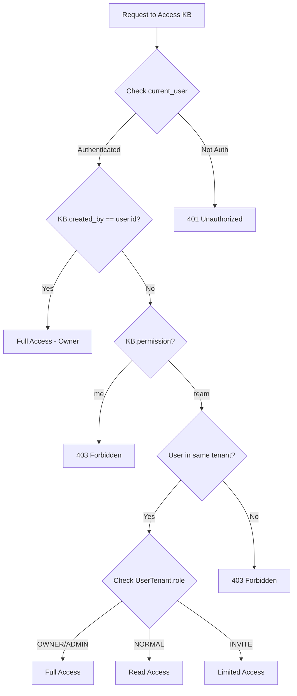

## 11. GraphRAG Processing Flow

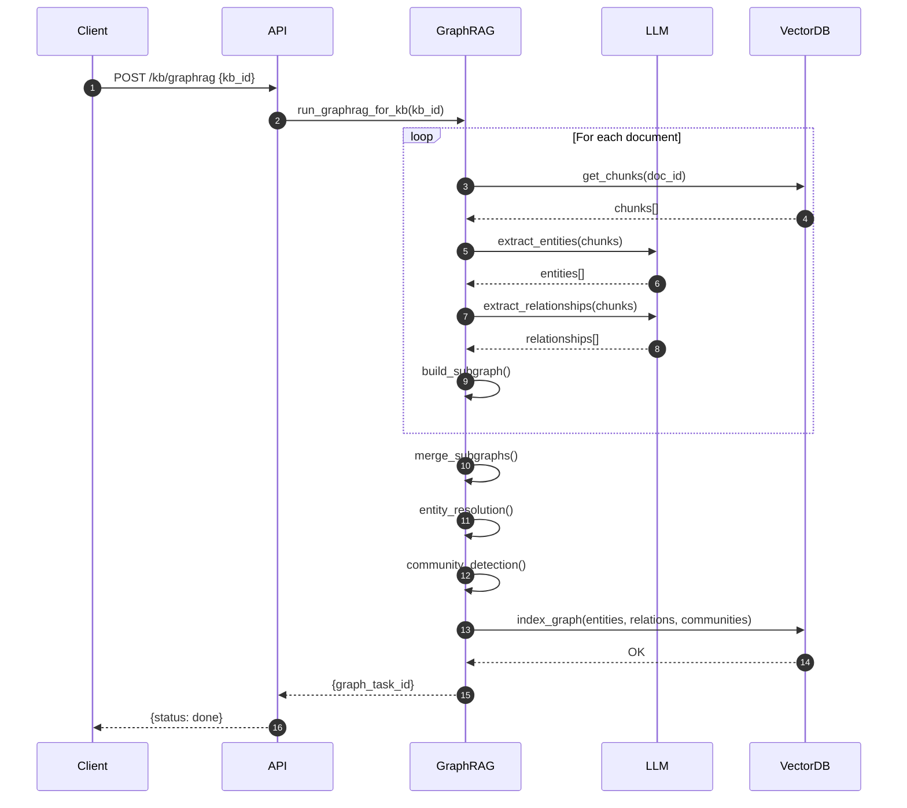

## 12. Complete Data Flow Overview

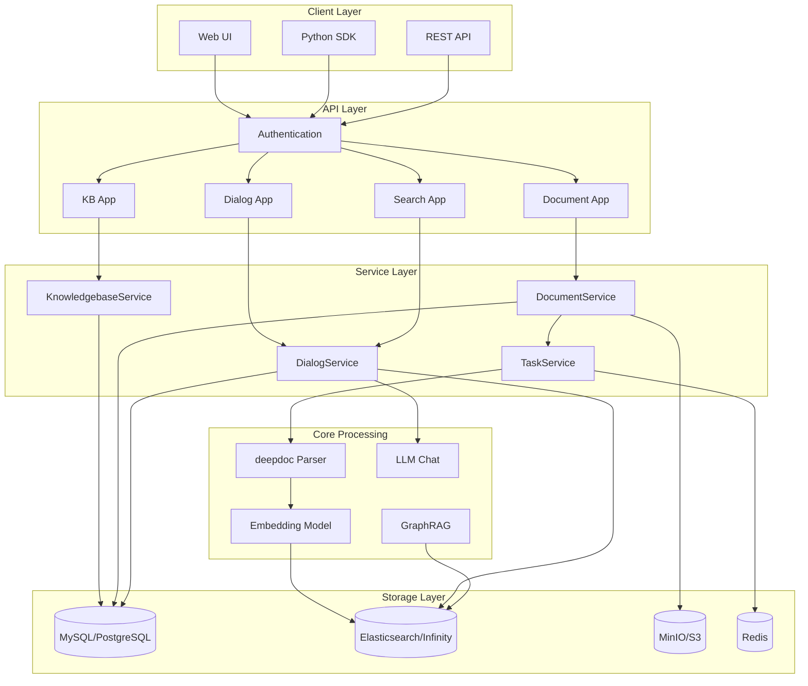
